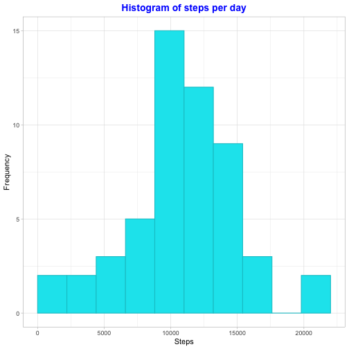
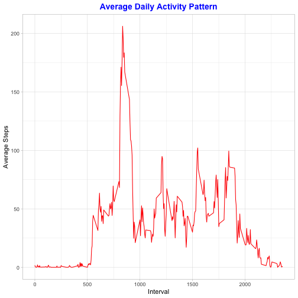
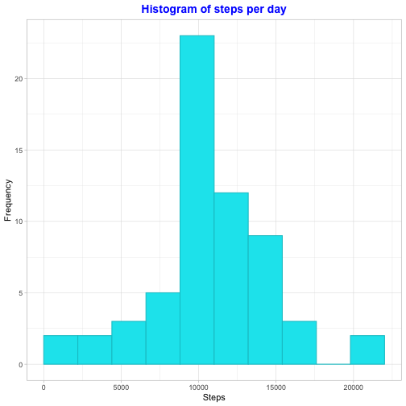
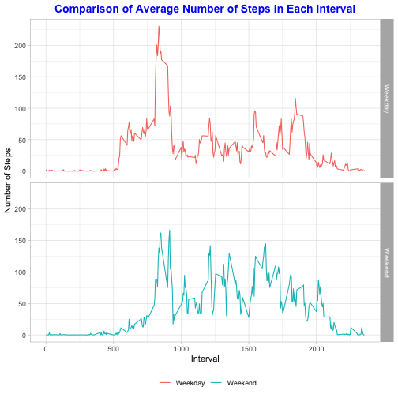

---
title: "Reproducible Research: Project 1"
author: "Shovit Bhari"
date: 2020-04-26
output: html_document
---

### File Download and Unzip


```r
if(!file.exists("./data")){dir.create("./data")}

url <-("https://d396qusza40orc.cloudfront.net/repdata%2Fdata%2Factivity.zip")
filepath <- "./data/activity.zip"
download.file (url, filepath)
unzip(zipfile = "./data/activity.zip", exdir = "./data")
```

### 1. Loading and processing the data
1.1. Load the data (i.e. \color{red}{\verb|read.csv()|}read.csv())  
1.2. Process/transform the data (if necessary) into a format suitable for your analysis

```r
library(ggplot2)
library(dplyr)
```

```
## 
## Attaching package: 'dplyr'
```

```
## The following objects are masked from 'package:stats':
## 
##     filter, lag
```

```
## The following objects are masked from 'package:base':
## 
##     intersect, setdiff, setequal, union
```


```r
activity <- read.csv("./data/activity.csv")
str(activity)
```

### 2. What is mean total number of steps taken per day?

2.1. Calculate the total number of steps taken per day.  


```r
Steps_Daily <- aggregate(activity$steps,list(activity$date), sum)
colnames(Steps_Daily) <- c("Date", "Steps")
str(Steps_Daily)
```

'data.frame':	61 obs. of  2 variables:
 $ Date : Factor w/ 61 levels "2012-10-01","2012-10-02",..: 1 2 3 4 5 6 7 8 9 10 ...
 $ Steps: int  NA 126 11352 12116 13294 15420 11015 NA 12811 9900 ...
2.2. If you do not understand the difference between a histogram and a barplot, research the difference between them. Make a histogram of the total number of steps taken each day  


```r
g <- ggplot(Steps_Daily, aes(Steps))
g+geom_histogram(boundary=2, binwidth=2200, 
                 col="turquoise3", fill="turquoise2")+
                 ggtitle("Histogram of steps per day")+
                 xlab("Steps")+ylab("Frequency")+
                 theme_light() +
                 theme(plot.title = element_text(color = "blue", size = 14, face = "bold", hjust=0.5))
```

```
## Warning: Removed 8 rows containing non-finite values (stat_bin).
```




2.3. Calculate and report the mean and median of the total number of steps taken per day

```r
summary(Steps_Daily$Steps)
```

   Min. 1st Qu.  Median    Mean 3rd Qu.    Max.    NA's 
     41    8841   10765   10766   13294   21194       8 

```r
mean_StepsDaily <- mean(Steps_Daily$Steps, na.rm=TRUE)
median_StepsDaily<- median(Steps_Daily$Steps, na.rm=TRUE)
```

The average number of steps taken per day is 1.0766189 &times; 10<sup>4</sup>. The median steps per day is 10765


### 3. What is the average daily activity pattern?
 

```r
#calculating the average number of steps over 5-minute interval
Steps_Interval <- aggregate(steps~interval, activity, mean, na.rm=TRUE)
interval<- as.numeric(names(Steps_Interval))
```

```
## Warning: NAs introduced by coercion
```

3.1. Make a time series plot (i.e. \color{red}{\verb|type = "l"|}type="l") of the 5-minute interval (x-axis) and the average number of steps taken, averaged across all days (y-axis) 


```r
g <- ggplot(Steps_Interval, aes(interval, steps))
g+geom_line(col="red")+
        ggtitle("Average Daily Activity Pattern")+
        xlab("Interval")+ylab("Average Steps")+
        theme(plot.title = element_text(face="bold", size=12))+
        theme_light() +
        theme(plot.title = element_text(color = "blue", size = 14, face = "bold", hjust=0.5))
```



3.2. Which 5-minute interval, on average across all the days in the dataset, contains the maximum number of steps?


```r
maxinterval <- filter(Steps_Interval, steps == max(steps))
max_interval <- maxinterval[1]
max_steps <- maxinterval[2]
```

$835^{th}$ interval contains maximum number of steps which is 206.1698113.

### 4.Imputing missing values

4.1. Calculate and report the total number of missing values in the dataset (i.e. the total number of rows with \color{red}{\verb|NA|}NAs)  


```r
#Calculating and reporting missing values
missing_values <- sum(is.na(activity$steps))
```

The total number of missing values is 2304.

4.2. Devise a strategy for filling in all of the missing values in the dataset. The strategy does not need to be sophisticated. For example, you could use the mean/median for that day, or the mean for hat 5-minute interval, etc.  

Let’s use a simple strategy : Missing values in the dataset will be replaced with mean per interval.  


```r
replaced_mean <- function(x) replace(x, is.na(x), mean(x, na.rm = TRUE))
```

4.3. Create a new dataset that is equal to the original dataset but with the missing data filled in.


```r
imputedActivity <- activity %>% group_by(interval) %>% mutate(steps= replaced_mean(steps))
head(imputedActivity)
```

```
## # A tibble: 6 x 3
## # Groups:   interval [6]
##    steps date       interval
##    <dbl> <fct>         <int>
## 1 1.72   2012-10-01        0
## 2 0.340  2012-10-01        5
## 3 0.132  2012-10-01       10
## 4 0.151  2012-10-01       15
## 5 0.0755 2012-10-01       20
## 6 2.09   2012-10-01       25
```

4.4. Make a histogram of the total number of steps taken each day and Calculate and report the mean and median total number of steps taken per day. Do these values differ from the estimates from the first part of the assignment? What is the impact of imputing missing data on the estimates of the total daily number of steps?


```r
total_Steps_Daily <- aggregate(imputedActivity$steps,list(imputedActivity$date), sum)
colnames(total_Steps_Daily) <- c("Date", "Steps")
g <- ggplot(total_Steps_Daily, aes(Steps))
g+geom_histogram(boundary=2, binwidth=2200, 
        col="turquoise3", fill="turquoise2")+
        ggtitle("Histogram of steps per day")+
        xlab("Steps")+ylab("Frequency")+
        theme_light() +
        theme(plot.title = element_text(color = "blue", size = 14, face = "bold", hjust=0.5))
```



### 5. Are there differences in activity patterns between weekdays and weekends?


5.1 Create a new factor variable in the dataset with two levels – “weekday” and “weekend” indicating whether a given date is a weekday or weekend day.

```r
imputedActivity$date <- as.Date(imputedActivity$date)
imputedActivity$weekday <- weekdays(imputedActivity$date)
imputedActivity$weekend <- ifelse(imputedActivity$weekday=="Saturday" | imputedActivity$weekday=="Sunday", "Weekend", "Weekday" )
head(imputedActivity$weekend, 10)
```

Creating a new dataframe of average steps per 5-minute interval across all weekdays or weekends.


```r
Activity_Week_Day_End <- aggregate(imputedActivity$steps , by= list(imputedActivity$weekend, imputedActivity$interval), mean)
names(Activity_Week_Day_End) <- c("weekend", "interval", "steps")
```
5.2. Make a panel plot containing a time series plot (i.e. \color{red}{\verb|type = "l"|}type="l") of the 5-minute interval (x-axis) and the average number of steps taken, averaged across all weekday days or weekend days (y-axis). See the README file in the GitHub repository to see an example of what this plot should look like using simulated data.  


```r
g<-ggplot(Activity_Week_Day_End, aes(x=interval, y=steps, color=weekend)) 
g+ geom_line()+
        facet_grid(weekend ~.) + xlab("Interval") + ylab("Number of Steps") +
        ggtitle("Comparison of Average Number of Steps in Each Interval") +
        scale_fill_gradient("Count", low = "blue", high = "red")+
        theme_light()+
        theme(legend.position = "bottom", legend.title = element_blank(),
              plot.title = element_text(color = "blue", size = 14, face = "bold", hjust=0.5)) 
```


